# 🛒 E-Commerce Sales Analytics Pipeline


A cloud-native data engineering pipeline designed to ingest, process, and visualize over 1 million rows of raw transactional data from a UK-based online retailer. This project implements a fully automated ETL workflow using PySpark, AWS S3, AWS Lambda, and PostgreSQL, capped off with an interactive Streamlit dashboard.

---

## 🏛 Architecture

<div align="center">
  
</div>

*For full project analysis, design decisions, and dashboard screenshots, see the **[Detailed Project Documentation](documentation/Project_Documentation.md)**.*

---

## ✨ Key Features

- **Robust PySpark ETL Engine:** Leverages PySpark's lazy evaluation and window functions to handle complex data cleansing, deduplication, and RFM (Recency, Frequency, Monetary) segmentation on massive datasets.
- **Account-Agnostic Infrastructure:** The `provision_aws.py` scripts dynamically fetch AWS account IDs and configure security groups on the fly, allowing identical infrastructure to be seamlessly deployed across different AWS accounts.
- **SOLID Object-Oriented Design:** The entire codebase was rigorously refactored using design patterns (Strategy, Repository, Template Method) to decouple data loading, transformation rules, and infrastructure provisioning.
- **Unified CLI Orchestrator:** A central `main.py` entry point acts as the "Platform Control Center" to handle S3 uploads, ETL execution, and dashboard rendering.

---

## 🚀 Quick Start

### 1. Prerequisites
- Python 3.9+
- AWS CLI configured with active credentials.
- PostgreSQL running (or dynamically provisioned via AWS RDS).

### 2. Setup
Install the required dependencies:
```bash
pip install -r requirements.txt
```

Provision the AWS Infrastructure (creates the S3 Buckets, Lambda Triggers, and RDS Database):
```bash
python scripts/provision_aws.py
```

### 3. Running the Pipeline via CLI
Our custom `Platform Control Center` handles all pipeline operations natively from the terminal:

- **Ingest Raw Data:** Uploads the raw CSV file to the AWS S3 `raw/` zone.
  ```bash
  python main.py upload
  ```
- **Execute PySpark ETL:** Triggers the extraction, transformation, and load sequences.
  ```bash
  python main.py etl
  ```
- **Launch Interactive Dashboard:** Spins up the Streamlit server to visualize the curated data.
  ```bash
  python main.py dashboard
  ```
- **Generate Static Charts:** Outputs Matplotlib/Seaborn analytics charts.
  ```bash
  python main.py charts
  ```

---

## 👥 Team & Roles
- **Ayush Singh:** Lead Platform & Visuals *(AWS Infrastructure, database schema, SQL queries, Streamlit dashboard)*.
- **Naman Vinay Singh:** Lead Data Pipelines & Quality *(OOP PySpark ETL code structure, strategy rules, modular testing suites)*.

*Note: Raw datasets, virtual environments, configuration secrets (`.env`), and test logs are kept local and excluded from version control.*
