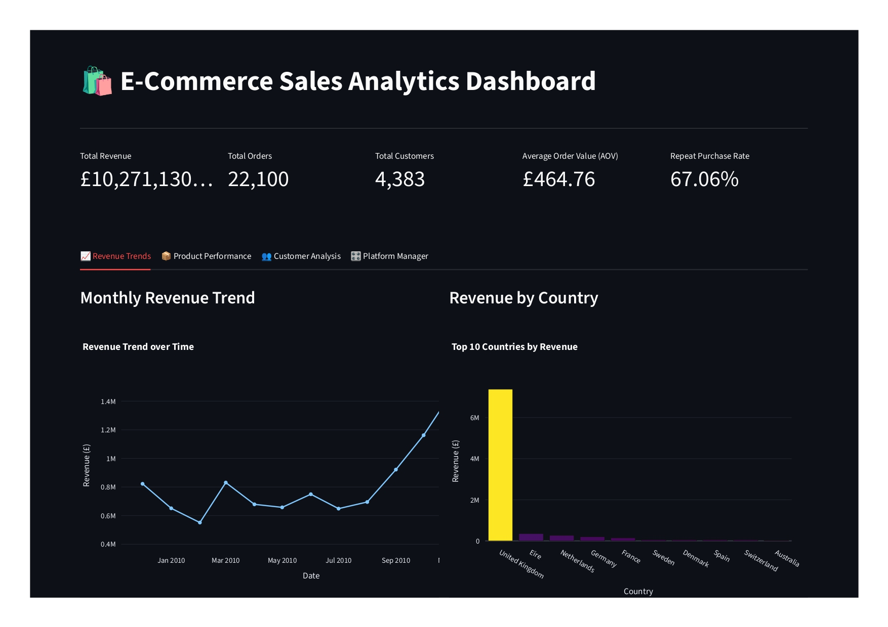
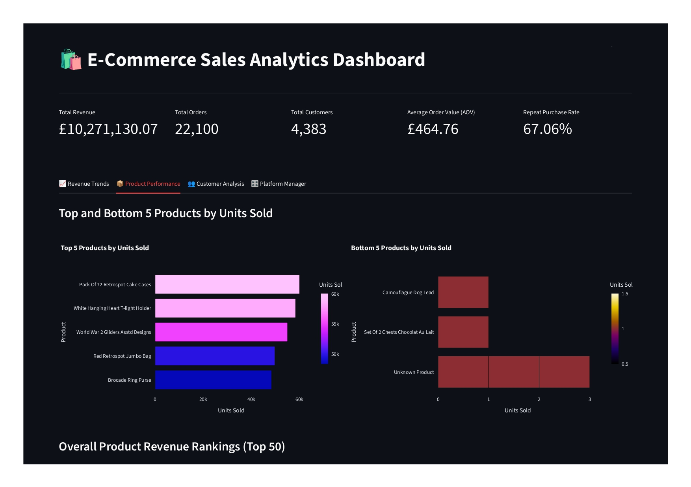
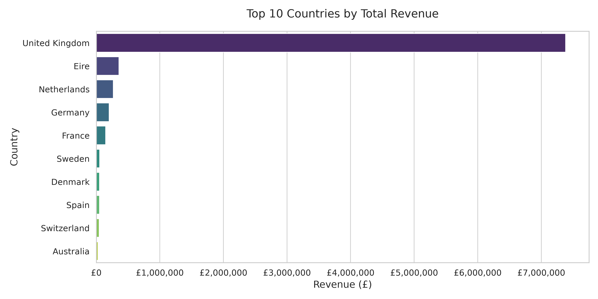
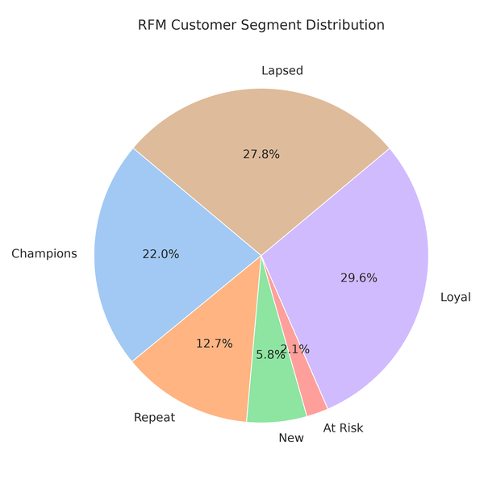

# E-Commerce Sales Analytics Pipeline

**Platform:** AWS  
**Team:** Ayush Singh, Naman Vinay Singh  

---

## 1. Project Overview
The E-Commerce Sales Analytics Pipeline is a cloud-native data engineering solution designed to process raw transactional data from a UK-based online retailer. The business previously lacked a reliable way to answer basic questions regarding product performance, customer value, and revenue trends due to their raw data being trapped in a massive flat file.

**Business Objective:** Build a robust, automated pipeline that ingests a raw transaction export, standardizes and cleans it using PySpark, models it into a relational database, and exposes the metrics through dynamic dashboards.

## 2. Dataset Details
The source data is the **Online Retail II Data Set**, a real transactional dataset of over 1 million line items covering transactions between Dec 2009 and Dec 2011. 
- **Raw Extract:** `online_retail_II.csv` (~1,067,371 rows) containing InvoiceNo, StockCode, Description, Quantity, InvoiceDate, UnitPrice, CustomerID, and Country.
- **Working Extracts:** During the PySpark ETL process, the data is intelligently split into `customers.csv` (~5,900 rows), `products.csv` (~4,600 rows), and a cleaned `orders.csv`.

## 3. Architecture Diagram

  

## 4. Cloud Resources
The project leverages the following AWS services to ensure scalability and reliability:
- **Amazon S3:** Used for zone-based data storage. Raw CSVs are ingested into the `raw/` prefix, while PySpark processed outputs are landed in the `curated/` prefix as compressed Parquet files.
- **AWS Lambda:** Acts as the event-driven trigger. A `PUT` event on the S3 raw zone invokes this Lambda function to initiate the ETL process automatically.
- **AWS RDS (PostgreSQL):** Serves as the high-performance relational reporting layer for querying aggregated dimensions and facts.

## 5. Database Design
We modeled the cleaned data into a classic Star Schema inside PostgreSQL:
- **Dimensions:** `dim_customers` (with RFM segments) and `dim_products` (with average prices).
- **Facts:** `fact_orders` carrying granular transaction details, foreign keys, and the computed `line_total`.
- **Analytics:** `analytics.revenue_summary`, `analytics.customer_retention`, and `analytics.product_performance` serve as pre-aggregated tables to power dashboards instantly.

## 6. ETL Flow
Our PySpark pipeline strictly adheres to SOLID Object-Oriented principles:
- **Extraction:** Validates and splits the raw single-source CSV into distinct customers, products, and transaction datasets.
- **Transformation:** Standardizes text (capitalization), cleanses missing variables, derives `order_status` (identifying cancelled 'C' invoices), calculates `line_total`, deduplicates exact match rows via window functions, and performs RFM (Recency, Frequency, Monetary) clustering on customers.
- **Loading:** Upserts clean records into the PostgreSQL schema and concurrently writes Parquet backups to S3.

## 7. SQL Analysis
Over 10 complex SQL queries were written and externalized to extract immediate business value. Highlights include:
- Generating Running Totals and Month-Over-Month revenue trends using `SUM() OVER(ORDER BY month)`.
- Ranking global catalog performance using `DENSE_RANK() OVER(PARTITION BY month ORDER BY revenue DESC)`.
- Extracting insights on lapsed high-value customers using Date functions and aggregations.

## 8. Visualizations
The final layer exposes the RDS database via an interactive **Streamlit Dashboard** and Matplotlib static charts. 
- **Revenue Trends:** Month-over-month line charts and a Country intensity heatmap.
- **Customer Analysis:** Pie charts of RFM segment distributions and histogram distributions of order values.
- **Product Performance:** Horizontal bar charts displaying the top 5 highest-selling and bottom 5 underperforming products.

*(Dashboard and Chart Output Screenshots)*

  
  
  
  

## 9. Challenges
1. **Account-Agnostic AWS Infrastructure:** Because the team (Ayush and Naman) developed the pipeline across separate AWS accounts, we needed the codebase to be completely account-agnostic. We solved this in the infrastructure layer by using `boto3.client('sts').get_caller_identity()` to dynamically fetch the running AWS Account ID. This allowed us to automatically generate globally unique S3 bucket names (`ecommerce-sales-analytics-{account_id}`). Furthermore, we externalized all dynamic database endpoints and configurations into a `.env` file populated at runtime, ensuring identical code could provision and interact with the AWS stack seamlessly across any environment.
2. **PySpark Complexities on Massive Datasets:** Executing PySpark ETL logic locally against over 1 million rows introduced memory and processing complexities. Handling advanced transformations—like RFM segmentation and complex window functions for deduplication—required strict optimization. We heavily leveraged PySpark's lazy evaluation and partitioned `Parquet` writes to prevent local out-of-memory errors while preserving performance.
3. **Cloud Security & Networking:** Encountered and successfully resolved AWS RDS connection timeouts caused by local IP addresses changing mid-development. We mitigated this by dynamically querying the `ipify` API in our provisioning scripts and intelligently updating the AWS EC2 Security Group ingress rules via Boto3.
4. **Codebase Maintainability:** The initial script-based approach resulted in tightly coupled "God" classes. We completely refactored the Python logic into strict Object-Oriented implementations utilizing the Strategy, Repository, and Template Method design patterns.
5. **Data Quality Realities:** Real-world data anomalies (missing customer IDs, negative quantities) required implementing complex PySpark window functions to clean the pipeline gracefully without catastrophic failures.

## 10. Learnings
- **SOLID Principles:** Mastered the application of Single Responsibility and Dependency Injection to make data pipelines modular, testable, and robust.
- **Event-Driven Automation:** Gained hands-on understanding of how cloud components communicate seamlessly, specifically hooking AWS S3 events directly into AWS Lambda execution.
- **PySpark Optimization:** Learned how to efficiently process millions of rows using lazy evaluation, window functions, and partitioning strategies over Parquet files.

## 11. Conclusion
The E-Commerce Sales Analytics Pipeline successfully transforms an unwieldy, million-row flat file into a fully automated, cloud-backed analytics engine. Business stakeholders can now leverage the Streamlit dashboard to instantly identify top-performing regions, flag lapsed VIP customers, and monitor revenue trajectories without manual spreadsheet manipulation. The pipeline is production-ready, strictly OOP-compliant, and built entirely on scalable AWS primitives.
